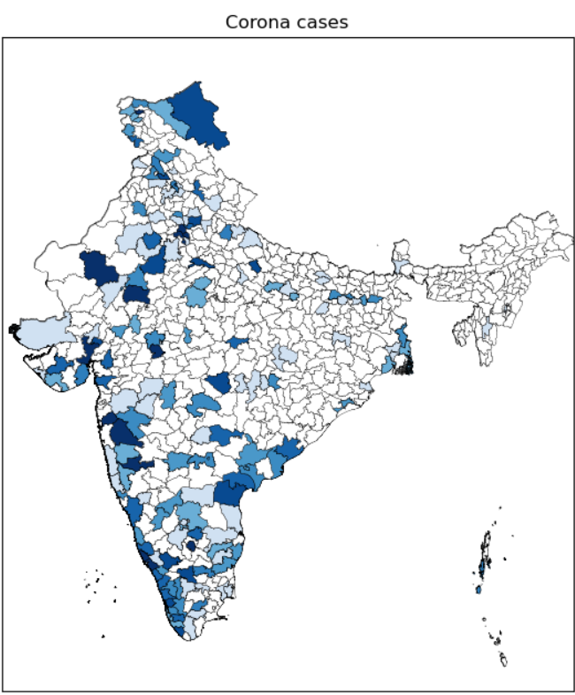

# covid-19-india-map-visualizer
corona or covid-19 cases visualizer district wise on India Map
  ## python program to visualize live corona cases in india:
  
  ## Excecute 
  -> install matplotlib,requests,basemap in your pc
  -> python main.py
  
  
