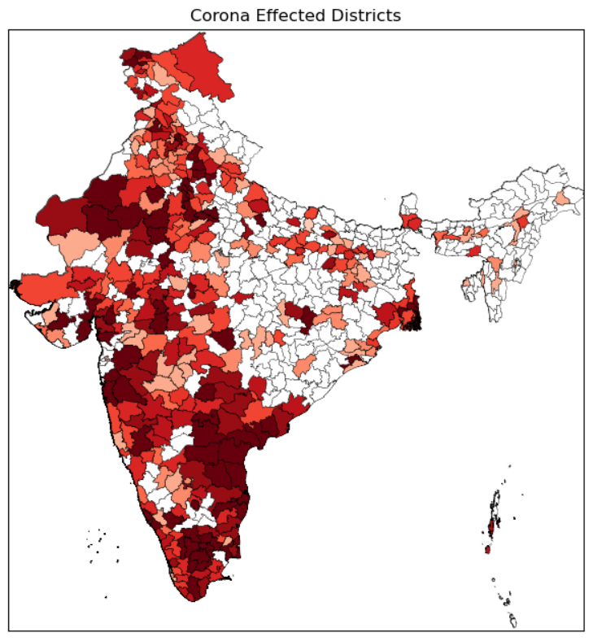

# live-covid-19-india-map-visualizer
Corona or Covid-19 cases visualizer based on district wise With India Map.Get live updated corona cases every time you run
## python program to visualize live corona cases in india:

## Excecute 
    1) install matplotlib,requests,basemap in your pc
    2) python main.py
  
  
